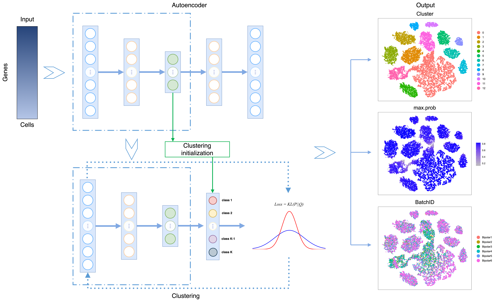

# DESCtorch
Deep Embedded Single-cell RNA-seq Clustering implementation with pytorch,  you can find implementation of tensorflow version of DESC in https://github.com/eleozzr/desc.  We will try more complicated network structure and loss function base on DESCtorch in the future!!! I will reproduce all result of this paper in my free time.


## Installtion

```
conda create -n DESCtorch python=3.6.10
conda activate DESCtorch
pip install DESCtorch
```
then you can run run DESCtorch for datasets(in run_dataset folder).

### Figure1_reproduce(workflow)
I use draw.io to plot the workflow, you can find the source file of draw.io in Figure1_reproduce folder

### Figure2_reproduce
will be updated in my free time

### ...


# Reference

Li, X., Wang, K., Lyu, Y., Pan, H., Zhang, J., Stambolian, D., ... & Li, M. (2020). Deep learning enables accurate clustering with batch effect removal in single-cell RNA-seq analysis. *Nature communications*, *11*(1), 1-14.


